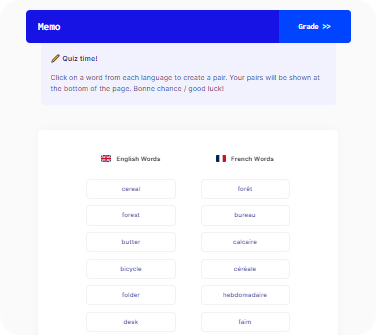

# Memo

### A language training app built in React



## Setup (Docker)

Clone the repository:

```sh
git clone https://github.com/chrjm/memo.git
cd memo
```

Build Docker container and run Dockerized server:

```sh
docker build -t memo .
docker run -p :3000:3000 memo
```

Open `http://127.0.0.1:3000/` in a browser to use the app.

## Usage

Follow the instructions provided within the app.

## Technical Design & Choices

- A goal during development was to minimise the duplication of vocabulary data. Early iterations shuffled the word lists by duplicating the vocabulary data and then shuffling the words in this copied version. This process was later improved by instead shuffling two integer arrays, one for each language, and then using these shuffled arrays to index each element of the vocabulary to minimise duplication of data while still retaining persistent shuffled orders. For example, the word array `["apple", "pear", "mango"]` could exist in one place in memory, and could be shuffled during rendering by accessing each element with a shuffled integer array `[1, 2, 0]`, resulting in a persistent rendered order of `["pear", "mango", "apple"]`;
- Functional components with hooks were preferred over class-based components for improved readability and conciseness;
- Context API was only used for parts of the state that needed to be shared globally to all components, such as which of the three states the app is currently in out of the three possible states: `learn`, `test` and `review`;
- `es-lint` and `Prettier` were used to keep code quality high and consistent across the project;
- From a UI/UX point-of-view, clicking a word from each language was preferred over click-and-drag solutions because of lessons learned from past experience. Older versions of the digital coaching board built in my project Semi-Pro featured click-and-drag functionality to move players around the field. However, this functionality was frustrating to many users, especially older users using tablet devices, and user testing revealed that users much preferred a two-click solution, as long as the intermediate steps of the pairing process were made clearly evident to the user;
- Lighthouse tests were performed throughout development iterations, guiding decisions to improve performance and accessibility, resulting in the submitted app scoring 100% for Performance, Accessibility and Best Practices in Lighthouse;
- Detailed test suites were written for all components, resulting in 100% code coverage across the application.
